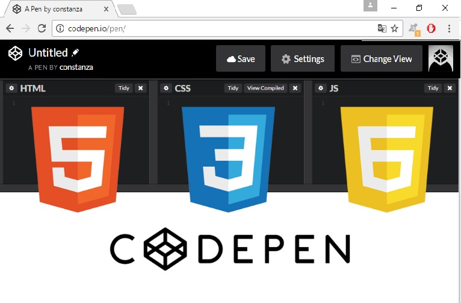
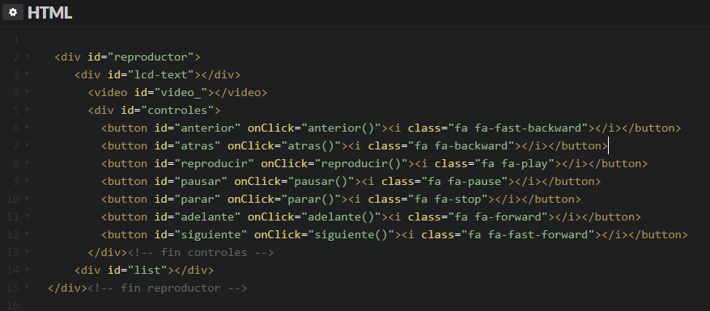
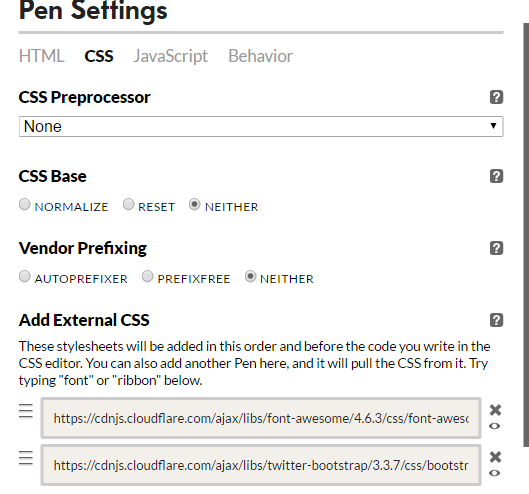
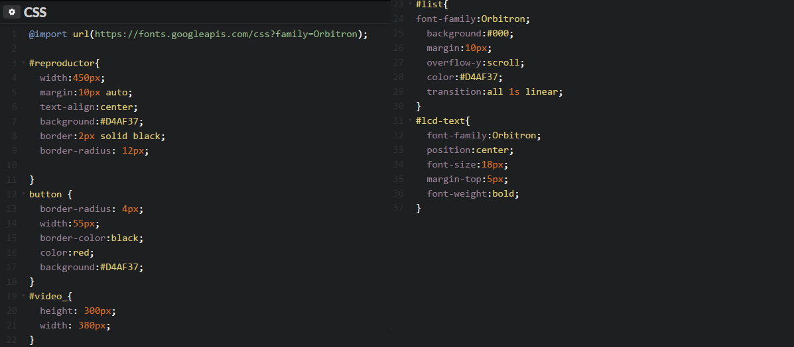
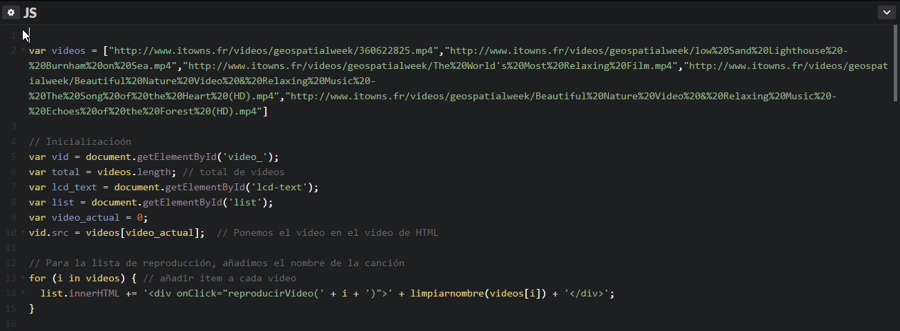
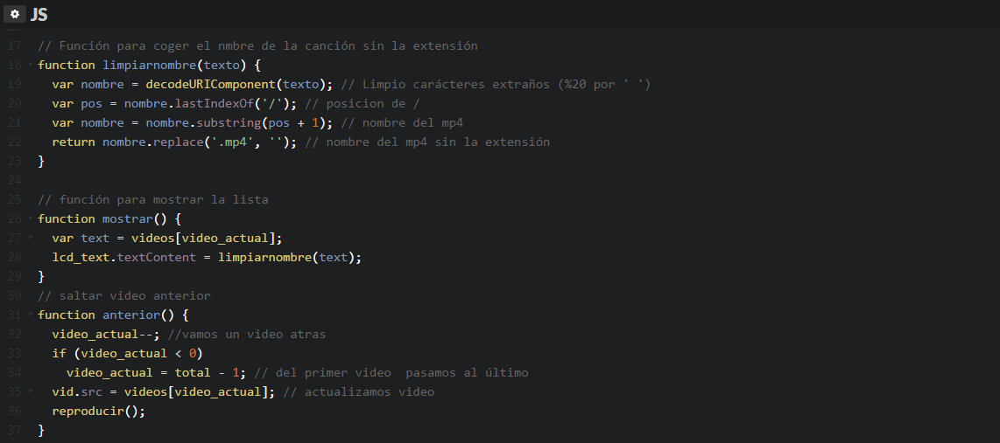
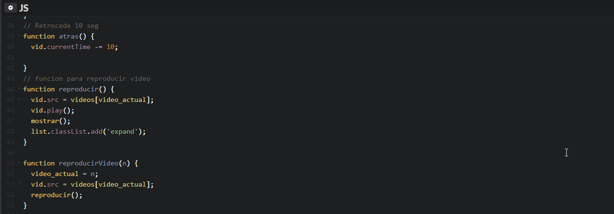
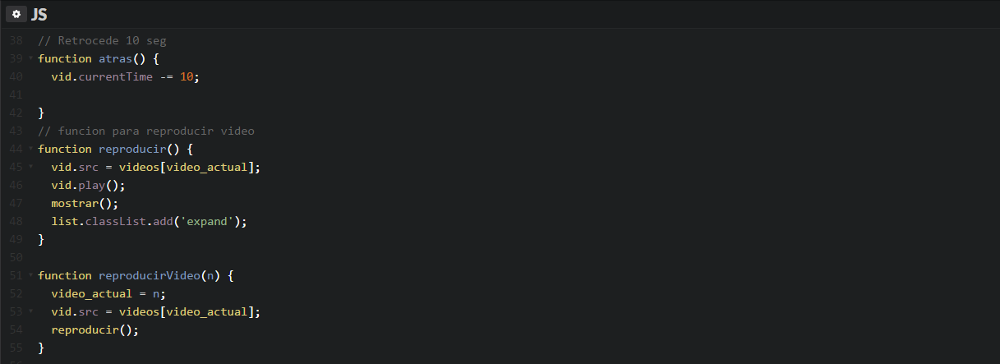
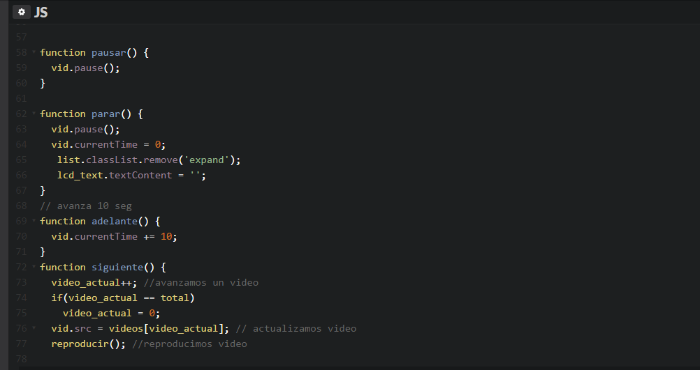
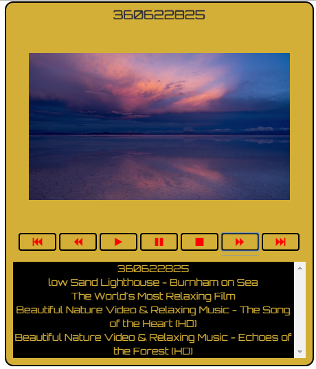

# Audio y Vídeo en JS

* Autor: [Constanza Polette Leon Baritussio](https://github.com/Alu0100673647)
* Fecha: 09/12/2016

## Codepen
El proyecto de Audio y Video en JS, fue desarrollado en la plataforma [codepen.io](https://www.google.es/url?sa=t&rct=j&q=&esrc=s&source=web&cd=1&cad=rja&uact=8&ved=0ahUKEwj_wu2BlOXQAhXFuBoKHchiBrUQFggcMAA&url=http%3A%2F%2Fcodepen.io%2F&usg=AFQjCNHO3JKM8oFotMd2fAEodqMzO7bGRg&sig2=kWZOX68zwmiv5s3GzWcDkg).

Utilizar codepen tiene la ventaja de que en una misma ventana puedes visualizar las tecnologías utilizadas: HTML para contenido, CSS para presentación y Javascript para programación. Y además se pueden visualizar los resultados.

# HTML

* Código del reproductor de vídeo:

# CSS

Para dar estilo a los botones, he añadido esta [dirección](https://cdnjs.cloudflare.com/ajax/libs/font-awesome/4.6.3/css/font-awesome.min.css) y [Bootstrap](https://cdnjs.cloudflare.com/ajax/libs/twitter-bootstrap/3.3.7/css/bootstrap.min.css)

* Código CSS

# JS

* Código JS

# El reproductor

El reproductor tiene la zona (lcd-text) en donde se muestra el nombre del vídeo que está actualmente en reproducción. El propio vídeo que se está reproduciendose, los controles (anterior,play,pause, etc.) y la lista de reproducción.

[El proyecto](http://codepen.io/cony/pen/ObpbrL)
